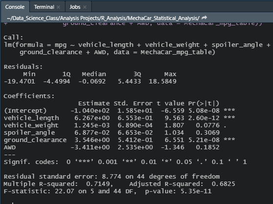
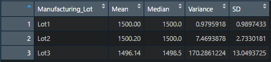
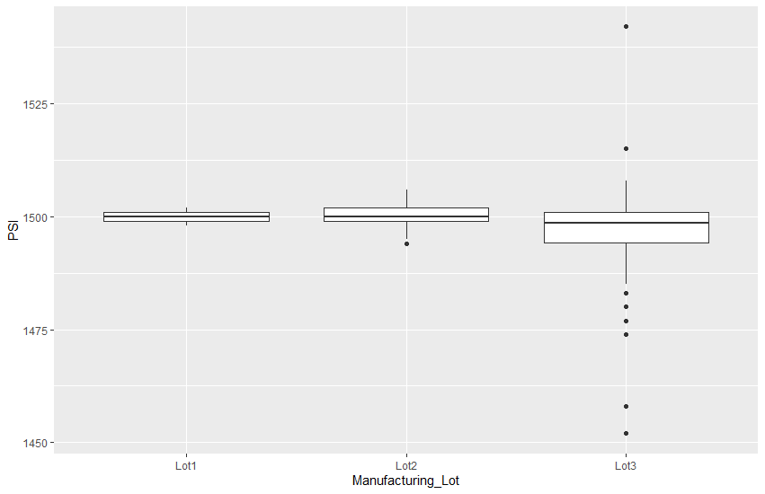
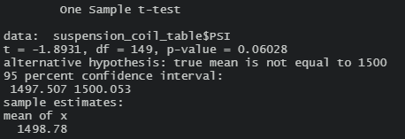
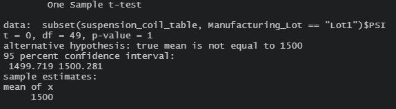
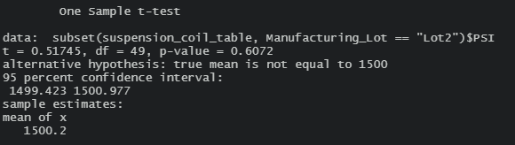
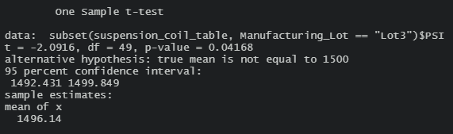

# **MechaCar Statistical Analysis**

## **Project Overview**
AutosRU commssions a review of the production data of its newest prototype car MechaCar. The following analysis includes the models to predict fuel efficiency, summary statistics of suspension coils, and evidence of production troubles in the manufacturing of suspension coils in Manufacturing Lot3. 

## **Methodology**
The analysis was conducted using R programming language on RStudio IDE. 

MPG factor prediction: Linear regression model was used to predict the significant factors affecting variance in the MPG. 

Summary statistics of suspension coils: mean, median, variance, and standard deviation of the PSI of suspension coils calculated using the summary() function of R. Further T-Tests of the PSI of suspension coils against population mean conducted.

Resources: 
* MechaCar_mpg.csv dataset containing the test results of 40 prototype Mechacars was used in the analysis of the MPG factor prediction. 
* Suspension_Coil.csv dataset containing the results from three production lots was used in the analysis of PSI of suspension coils.

## **Analysis**

### 1. Linear Regression to Predict MPG
#### Results

Assuming normal significance levels for variables (0.05), the results demonstrate that vehicle length, ground clearance, and intercept are statistically unlikely to produce random ammounts of variance to the mpg values in the dataset. 

The slope of the linear model is not zero because the coefficients are not equal to zero. 

While the R-Squared of the model suggests that 71% of predictions will be correct using this model, the statistical significance of the intercept is evidence that there is a lack of significant variables in the linear regression, i.e. the model is overfitted and fails to generalize and predict MechaCar prototypes correctly. 

### 2. Summary Statistics on Suspension coils
#### Results
##### Summary of total manufacturing lots

##### Summary by manufacturing lots

Given that the design specification of MechaCar suspension coils require variance of suspension coils below 100 PSI, the results demonstrate that the manufacturing lots meet the specification when accounted for in total. However, the slight difference between the mean and the median in the total summary suggests that the distribution of data is skewed left, which suggests the presence of outliers. Further analysis of the individual lots demonstrates high variance between the three manufacturing lots is high. Lot 3 coils deviate from the mean of Lot 3 by 13 PSI on average, with resulting variance of 170 PSI(squared), effectively making Lot 3 noncompliant with the design specifications. Boxplot below demonstrates the the spread of data in each lot and the outliers in Lot 3.

### 3. T-Tests on Suspension Coils
#### Results
##### Summary of the T-Test of all manufacturing lots against the population mean of 1500

The T-Test of the PSI across all manufacturing lots shows that the mean of the dataset of all manufacturing lots is not different from the population mean. P-value 0.06 suggests that there is no sufficient evidence to reject the null hypothesis, i.e. that there is no difference between the mean of the dataset and the population mean.

##### Summary of the T-Test of each manufacturing lot
**Lot1:**  
 
T-Test of Lot1 provides the strongest evidence of no difference between the mean of Lot1 suspension coils and the population mean. P-Value is equal 1, suggesting absolute certainty in the null hypothesis.

**Lot2:** 
 
T-Test of Lot3 provides evidence that there is no difference between the mean of Lot2 suspension coils and the population mean. P-Value is equal 0.6, which provides strong evidence that the null hypothesis is not false. 

**Lot3:** 
 
T-Test of Lot 3 confirms our findings in Summary Statistics of Suspension Coils above. P-Value of 0.04, assuming normal significance levels, suggests that there is evidence of difference between the mean of Lot3 suspension coils and the population mean. We therefore reject null hypothesis and accept the alternative hypothesis. 

### 4. Study Design: MechaCar vs Competition

For the first year of production and sales, the statistical study of MechaCar against the competition in its class can be done using the following metrics: 
1. Cost
2. Fuel efficiency (city and highway)
3. Horsepower

For cost, assuming there will be a range of cost depending on the build and specs, the following hypotheses may be appropriate: 
* H(0): There is no difference in the mean of costs of MechaCar and the mean cost of competition in its class.
* H(a): There is a difference in the mean of costs of MechaCar and the mean cost of competition in its class. 
*Alternative hypothesis is two-tailed*

For fuel efficiency, the following hypotheses may be appropriate: 
* H(0): There is no difference in the mean of MPG in the city (and highway) of MechaCar from the mean of MPG of the competition in its class.
* H(1): There is a difference in the mean of the MPG in the city (and highway) of MechaCar from the mean of MPG of the competition in its class. 
*Alternative hypothesis is two-tailed*

For horsepower, the following hypotheses may be appropriate: 
* H(0): There is no difference in the power output of Mechacar and the competition in its class.
* H(1): There is difference in the power output of Mechacar and the competition in its class. 
*Alternative hypothesis is two-tailed*

Statistical tests: 
Above hypotheses can be tested withwith a two-sample t-Test. It is also advisable to use multiple linear regression model to predict factors that affect fuel efficiency and horsepower respectively.

Types of data: 
Continuous numerical data: engine volume, number of cylinders, weight, horsepower 
Categorical Data: transmission type, drivetrain
